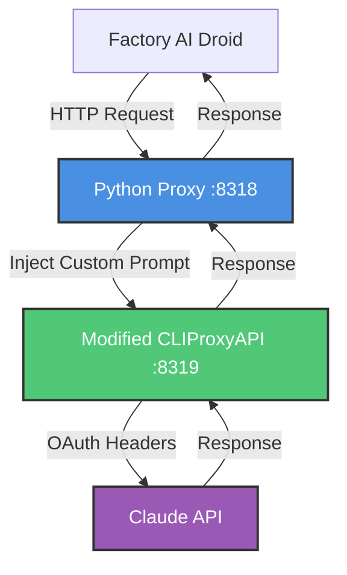

```
  _____          _                    ____       _     _
 |  ___|_ _  ___| |_ ___  _ __ _   _ | __ ) _ __(_) __| | __ _  ___
 | |_ / _` |/ __| __/ _ \| '__| | | ||  _ \| '__| |/ _` |/ _` |/ _ \
 |  _| (_| | (__| || (_) | |  | |_| || |_) | |  | | (_| | (_| |  __/
 |_|  \__,_|\___|\__\___/|_|   \__, ||____/|_|  |_|\__,_|\__, |\___|
                                |___/                     |___/
```

A proxy server that lets you use Claude Code OAuth authentication with Factory AI, while optionally injecting custom system prompts. Get Factory AI's powerful tooling with your Claude Code subscription and your own custom system prompt.

## Features

- **Claude Code OAuth Integration** - Use your Claude Code subscription with Factory AI (no API credits required)
- **Custom System Prompts** - Replace or extend Factory's default Droid system prompt
- **Full Factory AI Tooling** - Maintain access to file operations, git integration, search, and all Factory features
- **Automatic Token Management** - Handles OAuth token refresh and enforces model-specific token limits
- **Modified CLIProxyAPI** - Patches CLIProxyAPI to respect custom system prompts

## Requirements

- Python 3.8+
- uv (package manager)
- Go 1.21+ (for building CLIProxyAPI, one-time)
- Claude subscription
- Factory AI CLI

## Quick Start

### 1. Install uv and Dependencies

```bash
# Install uv
curl -LsSf https://astral.sh/uv/install.sh | sh

# Install dependencies
uv sync
```

### 2. Authenticate with Claude

```bash
uv run main.py --login
```

This will:
- Clone CLIProxyAPI (first time only)
- Automatically patch it to respect custom system prompts
- Build the patched binary
- Open your browser for OAuth login
- Save credentials to `~/.cli-proxy-api/`

### 3. Run the Proxy

```bash
uv run main.py
```

This will:
- Start CLIProxyAPI in the background
- Start the proxy server on port 8318
- Generate Factory config at `~/.factory/config.json`

### 4. Install Factory AI CLI and Start Droid

```bash
# Install Factory AI CLI
curl -fsSL https://app.factory.ai/cli | sh

# Start a droid session
droid
```

## Available Models

The following Claude models work with Claude Code OAuth:

- `claude-sonnet-4-5-20250929` (recommended)
- `claude-sonnet-4-20250514`
- `claude-3-5-haiku-20241022`

**Note:** The models are limited to those that are allowed in Claude Code for your subscription (the models above are under the Pro subscription).

## How It Works

```
Factory AI Droid
    ↓ [Original Droid system prompt]
Python Proxy (port 8318)
    ↓ [Injects custom system prompt + caps max_tokens]
Modified CLIProxyAPI (port 8319)
    ↓ [Respects custom prompt, adds OAuth headers]
Claude API
    ↓ [Responds with YOUR custom prompt]
Back to Factory AI
```

### What Happens

1. **Factory AI** sends requests with the default Droid system prompt
2. **Python Proxy** (this repo):
   - Intercepts the request
   - Replaces/appends your custom system prompt
   - Caps `max_tokens` to model limits (8192 for Claude)
   - Removes cache control fields
3. **Modified CLIProxyAPI**:
   - Respects your custom prompt (we commented out the override)
   - Handles Claude Code OAuth authentication
   - Adds required headers for Claude API
4. **Claude API** processes with YOUR custom prompt
5. Response flows back through the chain to Factory AI

### The Key Innovation

**CLIProxyAPI Modification**: We modified CLIProxyAPI's source code to stop overwriting system prompts. This is necessary because Claude Code OAuth tokens only work through CLIProxyAPI, not directly with the Anthropic API.

## Configuration

All configuration is automatic. Files are stored in:

- `~/.droid-proxy/` - CLIProxyAPI installation and config
- `~/.cli-proxy-api/` - OAuth tokens
- `~/.factory/config.json` - Factory AI configuration

### Custom System Prompts

Create custom system prompt while keeping Factory AI's tools and infrastructure. The proxy can replace or extend Factory's default Droid prompt, which is available here: [default_droid_sys_prompt.md](default_droid_sys_prompt.md).

**Custom prompt config file location:** `~/.droid-proxy/prompt-config.json`

#### Option 1: Replace Entire Prompt (Recommended)

Create a completely custom AI personality:

```json
{
  "mode": "replace",
  "prompt": "You are a senior software architect. Always prioritize code quality, security, and maintainability. Keep explanations concise and technical."
}
```

#### Option 2: Append to Droid Prompt

Keep Factory's Droid behavior but add your own rules:

```json
{
  "mode": "append",
  "prompt": "Additional rules:\n- Never use abbreviations in code comments\n- Always add error handling\n- Prefer composition over inheritance"
}
```

#### Option 3: External Prompt File

For longer prompts, use a separate file:

```json
{
  "mode": "replace",
  "prompt_file": "~/.droid-proxy/my-prompt.txt"
}
```

Then create `~/.droid-proxy/my-prompt.txt`:

```
You are an expert Python developer specializing in data engineering.

Skills:
- Apache Spark, Airflow, dbt
- SQL optimization
- Data pipeline design

Guidelines:
- Write production-ready code
- Include logging and error handling
- Add type hints and docstrings
- Suggest performance improvements
```

**Note:** Restart the proxy after changing the config for changes to take effect.

#### Testing Your Custom Prompt

To verify your custom prompt is working, add this to your prompt:

```
Always start your first response with "CUSTOM PROMPT ACTIVE" to confirm you're using the custom prompt.
```

If you see that text in Claude's response, your custom prompt is working!

## Commands

```bash
uv run main.py              # Run the proxy server
uv run main.py --login      # Authenticate with Claude Code OAuth
uv run main.py --setup      # Setup CLIProxyAPI only (no authentication)
uv run main.py --port 8080  # Use custom port (default: 8318)
```

## Troubleshooting

### Custom Prompt Not Working

If your custom prompt isn't being applied:

1. Check the proxy logs for `Applied custom system prompt` message
2. Verify the config file exists: `~/.droid-proxy/prompt-config.json`
3. Ensure the config JSON is valid (use a JSON validator)
4. Restart the proxy after making config changes
5. Add a test message to your prompt to confirm it's working

### CLIProxyAPI Build Errors

The first time setup requires building CLIProxyAPI from source:

- **Go not installed**: Install from https://go.dev/doc/install
- **Build fails**: Delete `~/.droid-proxy/CLIProxyAPI` and re-run `--setup`

### Authentication Issues

- **No auth found**: Run `uv run main.py --login` to authenticate
- **Token expired**: The proxy handles refresh automatically, but you can re-login if needed
- **Wrong credentials**: Delete `~/.cli-proxy-api/*.json` and login again
- **Rate limit**: Possibly, if you are seeing auth error, you might have hit the rate limit

### Max Tokens Error

The proxy automatically caps `max_tokens` to 8192 for Claude models. If you still see errors, check the proxy logs for warnings about token limits being adjusted.

## Architecture

### Data Flow



### Components

- **Factory AI Droid**: Sends requests with default system prompt
- **Python Proxy (port 8318)**: Intercepts requests, injects custom prompts, caps max_tokens
- **Modified CLIProxyAPI (port 8319)**: Handles OAuth authentication, respects custom prompts
- **Claude API**: Processes requests and returns responses

### Project Structure

```
coding-tool-proxy/
├── main.py              # Entry point script
├── prompt-config.json   # Your custom prompt config (optional)
└── factory_bridge/      # Core modules
    ├── __init__.py
    ├── config.py        # Configuration and constants
    ├── auth.py          # Authentication handling
    ├── cliproxy.py      # CLIProxyAPI management
    └── server.py        # HTTP proxy server

~/.droid-proxy/
├── CLIProxyAPI/         # CLIProxyAPI source and binary (auto-cloned)
└── cliproxy-config.yaml # CLIProxyAPI configuration (auto-generated)

~/.cli-proxy-api/
└── claude-*.json        # OAuth tokens (auto-created on login)

~/.factory/
└── config.json          # Factory AI config (auto-generated)
```

### Automatic Patching

Factory Bridge automatically modifies CLIProxyAPI during setup:

1. Clones CLIProxyAPI from GitHub
2. Patches `internal/runtime/executor/claude_executor.go` to comment out system prompt overrides in three locations:
   - `Execute` method: Comments out conditional system prompt override
   - Streaming method: Comments out system prompt override
   - `CountTokens` method: Comments out conditional system prompt override
3. Builds the patched binary

This ensures your custom prompts are respected instead of being overwritten with Claude Code's default instructions. No manual editing required!

## Credits

Inspired by [vibeproxy](https://github.com/automazeio/vibeproxy).

Based on [CLIProxyAPI](https://github.com/router-for-me/CLIProxyAPI) by router-for-me - A proxy that wraps CLI OAuth flows for AI services.

## License

MIT License - see [LICENSE](LICENSE) file for details.

This project modifies [CLIProxyAPI](https://github.com/router-for-me/CLIProxyAPI) which has its own license.
